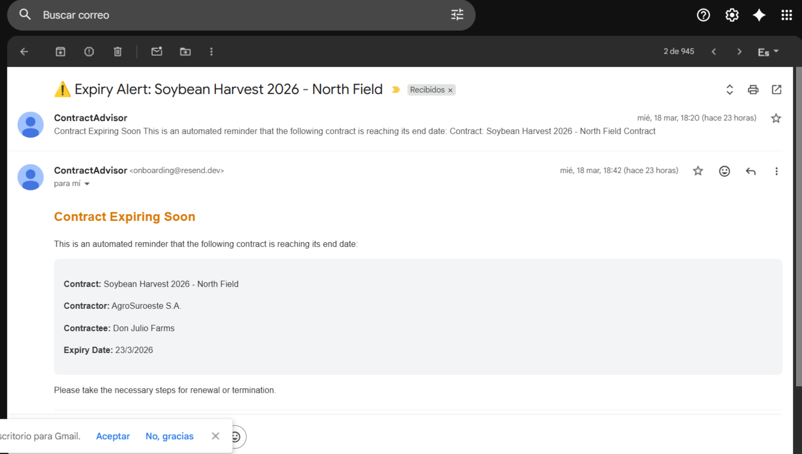

# ContractAdvisor 🌾

**Full-Stack Contract Management Platform for Agricultural Studios**

ContractAdvisor is a production-ready web application built to help agricultural studios digitize and manage their contracts end-to-end. It features role-based access control, internal contract messaging, automated expiry email alerts, staff management, and a real-time analytics dashboard.

🔗 **[Live Demo](https://contractadvisor.vercel.app)** — Instant access with demo accounts. No registration required.

---

## 🚀 Demo Access

| Role               | Button on landing page  |
| ------------------ | ----------------------- |
| Admin / Accountant | "Demo Accountant/Admin" |
| Employee           | "Demo Employee"         |

---

## ✨ Features

### Contract Management

- Create, edit, and delete agricultural contracts
- Search contracts by name or client
- Pagination for large contract lists
- View contracts sorted by upcoming expiry date
- Role-based visibility: all team members can view studio contracts, but only the assigned employee can edit or delete their own

### Role-Based Access Control

- **Admin / Accountant** — full access: manages contracts, staff, assignments, and receives expiry alerts
- **Employee** — can view all studio contracts, manage their own, and communicate via internal chat
- Invite code system for onboarding new employees to a studio

### Authentication

- Credential-based login with bcrypt password hashing
- Google OAuth via NextAuth.js — sign in with your Google account in one click
- Session management handled server-side with `getServerSession`

### Internal Messaging

- Per-contract chat between the contract owner and the assigned employee
- Unread message badge on contract cards with animated indicator
- Smart recipient routing: messages automatically go to the correct counterpart
- Integrated with the global notification bell

### Automated Expiry Alerts

- Contracts expiring within 15 days automatically trigger email notifications to the contract owner
- Emails sent via Resend with full contract details (contractor, contractee, expiry date)
- `expiryNotificationSent` flag prevents duplicate alerts
- See screenshot below ↓

### Staff Management

- Admins can deactivate employees to revoke platform access
- Employees are never deleted — preserved for legal compliance and audit trail
- Contract reassignment: any contract can be reassigned to another team member

### Dashboard

- Live stats: Active Contracts, Upcoming Expirations, Expired Contracts
- Recent contracts table sorted by soonest expiry
- Notification bell with real-time unread count

---

## 📧 Automated Email Alert — Screenshot

> Emails are sent automatically 15 days before a contract expires. The following is a real notification received during development:



The email includes contract name, contractor, contractee, and expiry date — giving the account manager everything they need to act immediately.

---

## 🛠️ Tech Stack

| Layer           | Technology                             |
| --------------- | -------------------------------------- |
| Framework       | Next.js 16 (App Router)                |
| Language        | TypeScript (99.5%)                     |
| Database        | MongoDB + Mongoose                     |
| ORM (secondary) | Prisma                                 |
| Auth            | NextAuth.js v4 + bcrypt + Google OAuth |
| Email           | Resend                                 |
| Image Storage   | Cloudinary                             |
| Styling         | Tailwind CSS v4                        |
| Testing         | Jest + React Testing Library           |
| Linting         | ESLint                                 |
| Deployment      | Vercel                                 |

---

## 🏗️ Project Structure

```
contract-advisor/
├── app/                  # Next.js App Router — pages & API routes
├── components/           # Reusable UI components
├── models/               # Mongoose data models
├── config/               # DB connection & app config
├── context/              # React Context — global state & notifications
├── types/                # TypeScript type definitions
├── utils/                # Helper functions & server utilities
├── __tests__/            # Jest unit & integration tests
└── public/               # Static assets
```

---

## 🧩 Key Architecture Decisions

**Visibility vs. Edit permissions** — All studio employees can view all contracts, enabling team collaboration and coverage. Only the assigned employee can modify their own contracts, protecting data integrity.

**Soft-delete for staff** — Employees are deactivated, never deleted. This preserves the audit trail and satisfies legal data retention requirements common in agricultural business contexts.

**Smart message routing** — The chat component automatically determines the recipient based on whether the current user is the contract owner or the assigned employee, eliminating manual recipient selection.

**`expiryNotificationSent` flag** — Prevents repeated email alerts for the same contract across cron cycles. Resets only when intentionally triggered, avoiding notification spam.

**Server Components for dashboard** — The panel fetches contract data directly on the server using `getServerSession`, reducing client-side JavaScript and keeping sensitive data off the client.

---

## 🧪 Testing

```bash
npm run test
```

Tests written with Jest and React Testing Library, covering core components and utility functions.

---

## ⚙️ Getting Started Locally

### Prerequisites

- Node.js 18+
- MongoDB database (local or Atlas)
- Cloudinary account
- Resend account

### Installation

```bash
git clone https://github.com/EmanuelEvangelista/contract-advisor.git
cd contract-advisor
npm install
cp .env.example .env.local
# Fill in your credentials
npm run dev
```

Open [http://localhost:3000](http://localhost:3000)

---

## 🔐 Environment Variables

```env
MONGODB_URI=
NEXTAUTH_SECRET=
NEXTAUTH_URL=
CLOUDINARY_CLOUD_NAME=
CLOUDINARY_API_KEY=
CLOUDINARY_API_SECRET=
RESEND_API_KEY=
DATABASE_URL=
```

---

## 📦 Scripts

```bash
npm run dev      # Development server
npm run build    # Production build
npm run start    # Production server
npm run lint     # ESLint
npm run test     # Jest test suite
```

---

## 👨‍💻 Author

**Emanuel Evangelista** — Frontend & Full-Stack Developer

[GitHub](https://github.com/EmanuelEvangelista) · [LinkedIn](https://www.linkedin.com/in/emanuel-evangelista-102b2b292) · [Portfolio](https://personal-portfolio-rho-three-30.vercel.app/)

---

## 📄 License

MIT License
